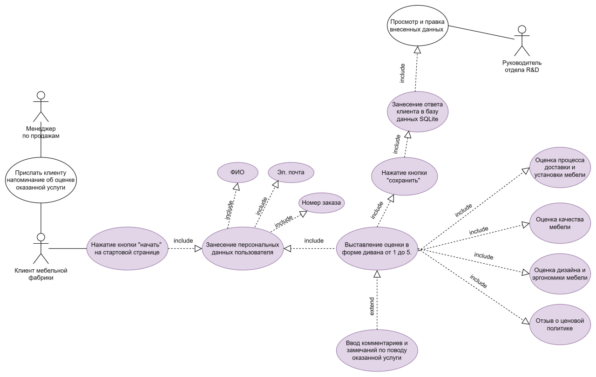
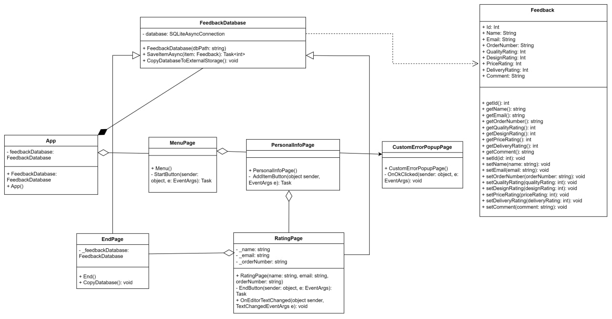
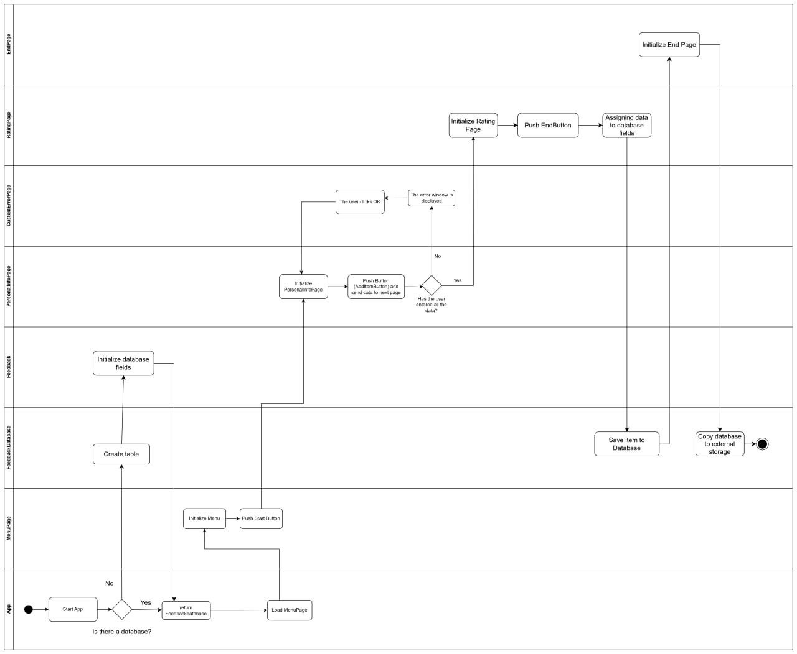
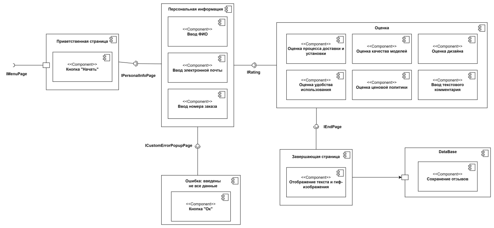
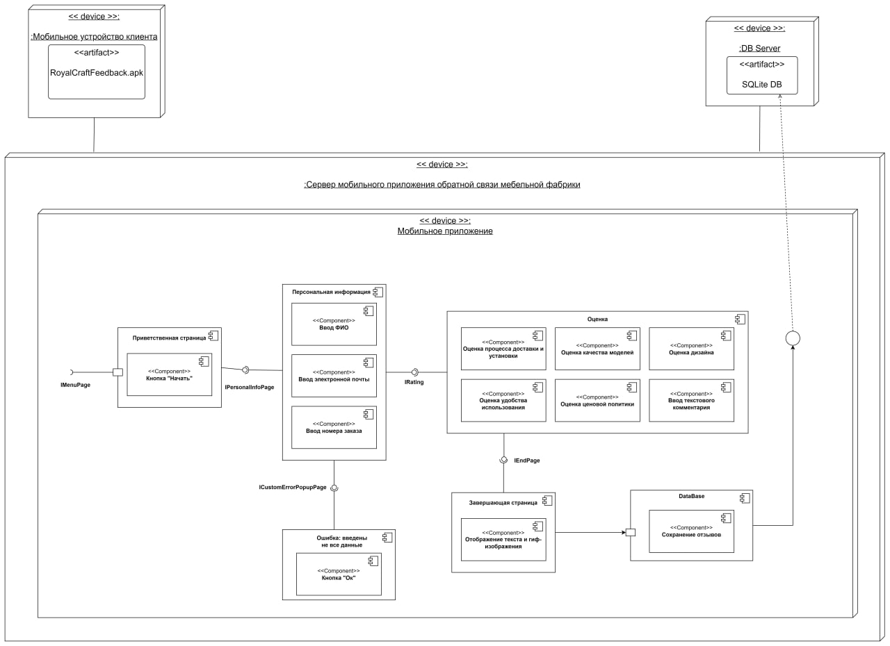
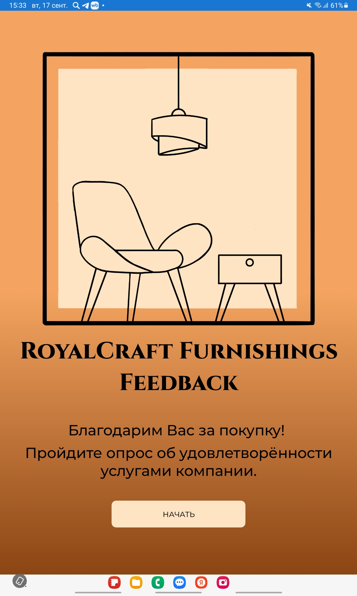
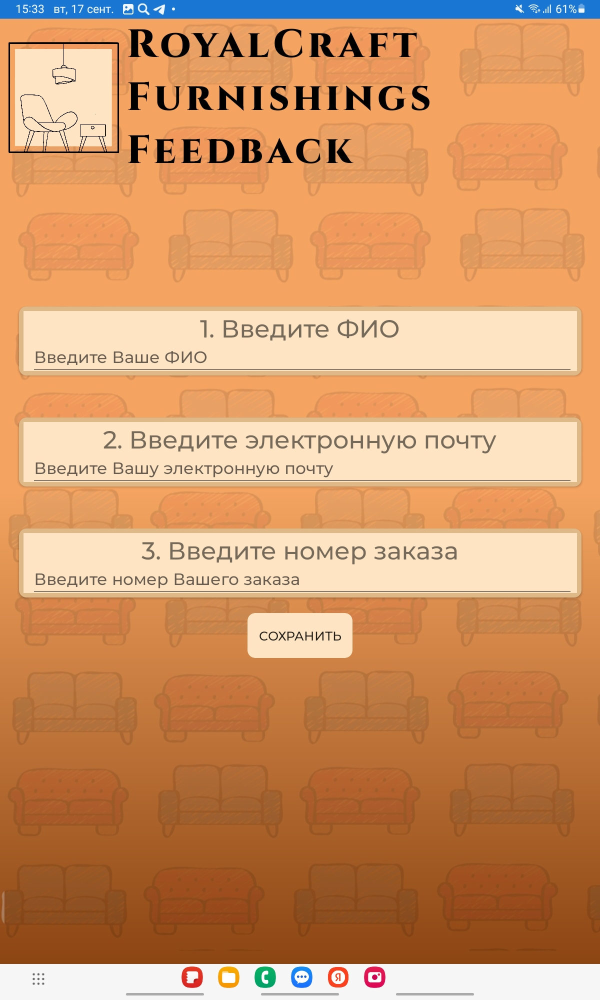
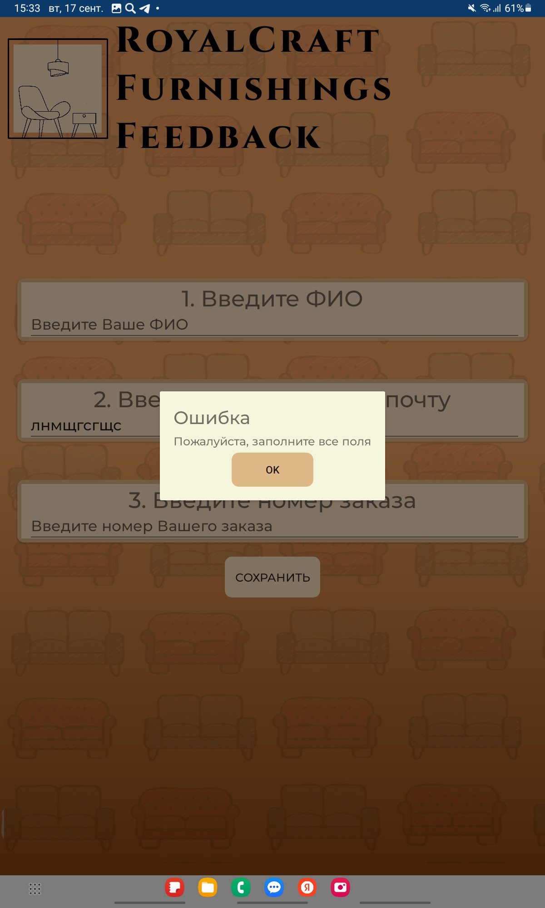
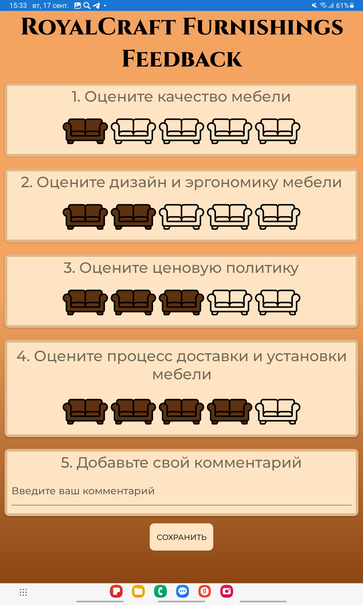
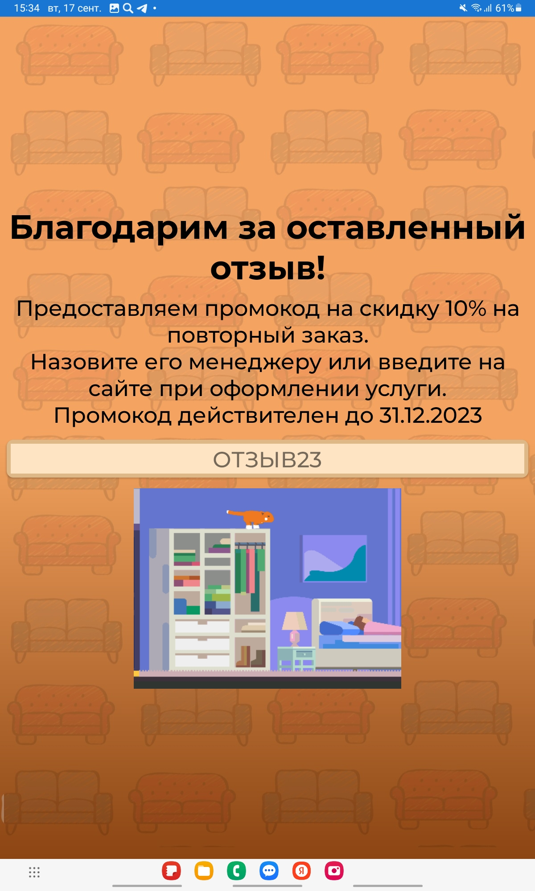

# Разработка мобильного приложения для сбора обратной связи мебельной фабрики - RCFeedback
Данное приложение разработано в рамках курсовой работы моего обучения на направлении "Бизнес-информатика" в РЭУ им. Г.В. Плеханова
## Цель бизнеса
- После анализа узких мест бизнес-процессов мебельной фабрики была предложена автоматизация процесса сбора обратной связи. 
- **Ожидаемый эффект** от данного внедрения - повышение лояльности клиентов, увеличение прибыли
- **Ожидаемая функциональность** - сбор личных данных пользователя и его оценок по критериям качества обслуживания. Обработка и хранение полученной информации в базе данных SQLite.
- В качестве языка программирования был выбран C#, а именно фрйемворк Xamarin
- На этапе проектрования были разработаны UML диаграммы, с которыми можно ознакомиться ниже

## Проектирование приложения
1) **Use Case диаграмма** создается в начале проектирования для описания функциональных требований системы с точки зрения ползователя.

2) **Диаграмма классов** показывает структуру системы, описывая классы, их атрибуты, методы и связи между ними.
3) **UML диаграмма активности** визуализирует выполнение операций, переходы и потоки данных, полезна для моделирования процессов и алгоритмов.
4) **UML диаграмма компонентов** отображает высокоуровневую структуру системы, взаимодействие компонентов и реализуемую функциональность.
5) **UML диаграмма развертывания** показывает физическое размещение программных компонентов на узлах, взаимодействие с оборудованием и сетями, помогая понять архитектуру системы в реальных условиях.

### UML-диаграмма вариантов использования
-   
Сценарий Use Case: Менеджер по продажам отправляет запрос на оценку услуги клиенту. Клиент заходит в приложение, заполняет персональные данные, оценивает обслуживание по шкале, оставляет комментарии и сохраняет результат. Данные сохраняются в базе SQLite для анализа руководителем отдела R&D.

### UML-диаграмма классов
-   
Класс App создает объект Menu и устанавливает его как главную страницу, указывая на композицию. Четыре страницы (MenuPage, PersonalInfoPage, RatingPage, EndPage) связаны через агрегацию. PersonalInfoPage использует CustomErrorPopupPage для отображения ошибок. Классы Feedback и FeedbackDatabase управляют данными в SQLite. App включает FeedbackDatabase, а RatingPage и EndPage зависят от его функций.

### UML-диаграмма активности
-   
Приложение запускается, проверяется наличие базы данных. Если она отсутствует, создается новая таблица в FeedbackDatabase с полями для данных об услуге. Пользователь попадает на MenuPage и нажимает кнопку, переходя на PersonalInfoPage, где вводит свои данные (ФИО, email, номер заказа). Если данные не введены, возникает ошибка с требованием заполнить поля. После успешного ввода и нажатия кнопки "Сохранить", пользователь переходит на RatingPage, где оценивает качество, дизайн, цену и доставку, а также может оставить комментарий. Нажав снова "Сохранить", пользователь сохраняет данные в базу и переходит на финальную страницу с благодарностью и промокодом. В конце база данных копируется во внешнюю память приложения для анализа.

### UML-диаграмма компонентов
-   
Как можно заметить, большинство компонентов совпадают с ранее обозначенными классами и расположены в последовательности, также ранее отмеченное в диаграмме последовательностей. Здесь можно легко отследить какие будут отображаться интерфейсы и данная диаграмма дает обобщенное понимание о  структуре мобильного приложения. 

### UML-диаграмма развертывания
-   
На диаграмме развертывания добавлено мобильное устройство клиента в качестве клиентского устройства, которое будет взаимодействовать с системой. Также добавлен символ сервера базы данных для хранения и обработки данных системы 

## Пользовательский интерфейс

- При запуске приложения "Royal Craft Furnishings Feedback" пользователь видит первую страницу с логотипом компании и приглашением участвовать в опросе.  
 

- После нажатия кнопки "Начать" открывается страница для ввода персональных данных (ФИО, email, номер заказа). 
 

- Если данные введены не полностью, появляется всплывающее окно с сообщением об ошибке. 
 

- При успешном сохранении пользователь переходит на страницу оценки, где может оценить качество, дизайн, цену и доставку мебели, а также оставить комментарий. Оценка представлена в виде диванов вместо звезд.  
 
- После нажатия кнопки "Сохранить" пользователь попадает на финальную страницу с благодарностью, промокодом на скидку 10%, и позитивным GIF-изображением котика.  
 

